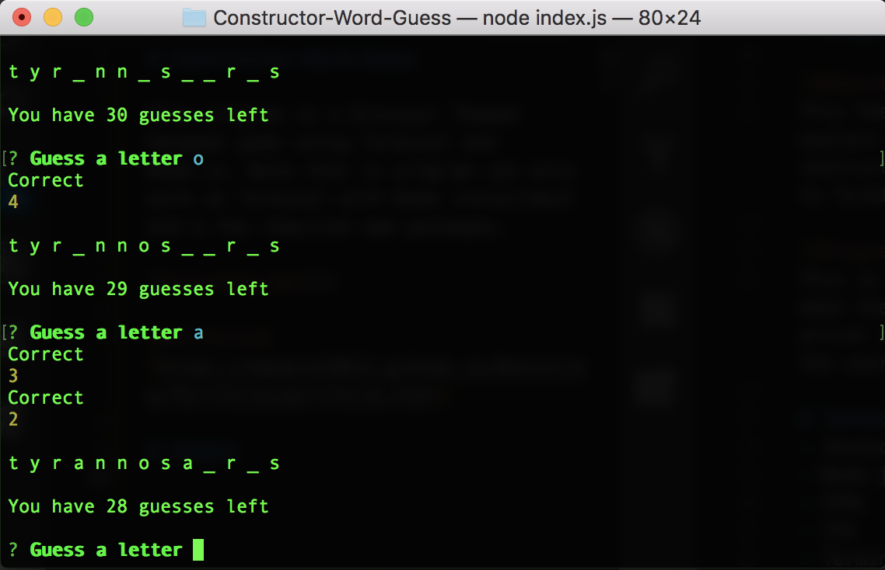

# Constructor-Word-Guess

This program is a Dinosaur Themed Hangman game using Terminal and Node.js. Note that is program can only work on Terminal with Node installment and a few required npm packages.

[Dino-Hang-Man](https://mawais54013.github.io/Constructor-Word-Guess/)

[Portfolio](https://mawais54013.github.io/Bootstrap-Portfolio/portfolio.html)

# Images
The following is a pic of the program in action with the user guessing the letters and it displays them while also showing the remaining guesses.


# Technology Used
- Javascript
- Node.js
- HTML
- CSS
- Terminal
- UIKit
- NPM

# Code Snippets
1) This codes checks each of the user's input with each of the letters in the current word. If there is a match, then it replaces that letter. 
```
for(var i = 0; i<word.length; i++)
{
    // after checked then correct is shown and then word is updated with underscore for the remaining letters
    if(text === word[i])
    {
        console.log("Correct");
        place[i] = text
        y = place.toString();
        x = y.replace(/,/g,' '); 
        // area is a length and it is decreased
        area--;
        used.push(text);
        console.log(area);
    
    }
} 
```
# Author 
[Muhammad Awais](https://github.com/mawais54013/Bootstrap-Portfolio)
